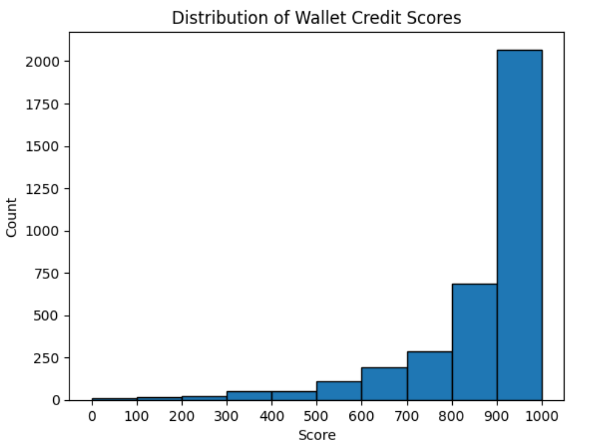

# Analysis of Wallet Credit Scores

We scored **≈3,400** wallets from the sample. With **higher = more responsible**, here’s what we see in 100‑point bins:

- **0–100 (≈2 wallets):**  
  The very lowest scores: wallets that stand out as extreme anomalies—likely automated or exploit addresses with highly unusual activity.

- **100–200 (≈5 wallets):**  
  A handful of near‑anomalous cases, possibly test or staging wallets with almost no meaningful on‑chain usage.

- **200–300 (≈10 wallets):**  
  Small sample of low‑activity wallets—maybe new entrants or one‑off participants.

- **300–400 (≈30 wallets):**  
  Emerging users: a few deposits or borrows but still minimal activity and inconsistent repay history.

- **400–500 (≈50 wallets):**  
  Moderate‑activity wallets: some deposits and borrows with occasional repays, but not yet stable.

- **500–600 (≈100 wallets):**  
  Mid‑tier reliable users: regular deposits and repays, few liquidations.

- **600–700 (≈190 wallets):**  
  Above‑average activity: higher deposit volumes, solid repay ratios, almost no liquidations.

- **700–800 (≈300 wallets):**  
  Strong contributors: diversified assets and consistent on‑chain behavior, demonstrating responsible usage.

- **800–900 (≈680 wallets):**  
  Top performers: large combined deposits, flawless repay records, zero liquidations.

- **900–1000 (≈2,050 wallets):**  
  **Elite tier**: the vast majority of “textbook” users—long histories, multiple assets, perfect repay-to-borrow ratios, and no liquidations.
